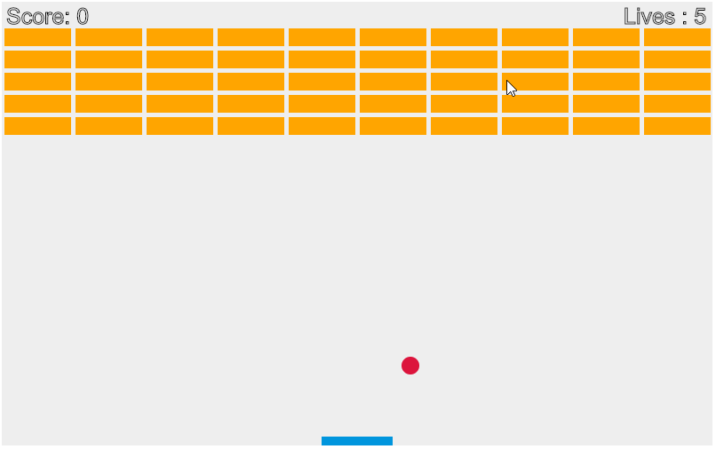

# JSretroBricks
Recreated bricks for learning purposes 

I made this while tryign to learn several algorythms. I am still inexprienced in this sector. but well I am trying my best to undersrtand how those enviroments work.

I made research on how to create this. in the following GIF you can see how it works. but you can download the code and test it as well

